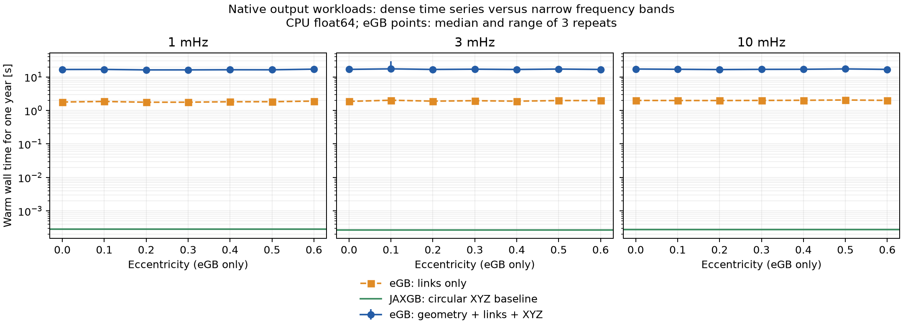

# Measured CPU wall times

**Paper comparison:** these timings do not reproduce arXiv:2608.24546 Figure 8.
See [the comparison note and additional timing diagnostic](PAPER_COMPARISON.md).

One source, one year (365.25 days), CPU float64. eGB: 1PN with periastron advance, fixed eccentricity, 5 s cadence. JAXGB: circular baseline, 2,048 Fourier bins. These are native output workloads, not equal-accuracy implementations.

eGB values below are the median summed wall time of geometry + links + pyTDI over three full-year repeats. JAXGB values are medians of 20 synchronized, JIT-compiled XYZ calls with geometry cached.

| Eccentricity | eGB 1 mHz [s] | eGB 3 mHz [s] | eGB 10 mHz [s] |
|---|---:|---:|---:|
| 0 | 16.739 | 16.851 | 17.241 |
| 0.1 | 16.828 | 17.456 | 16.954 |
| 0.2 | 16.261 | 16.783 | 16.653 |
| 0.3 | 16.281 | 17.057 | 16.876 |
| 0.4 | 16.421 | 16.757 | 16.952 |
| 0.5 | 16.379 | 17.209 | 17.385 |
| 0.6 | 17.111 | 16.788 | 16.837 |

| Frequency | JAXGB warm XYZ [ms] |
|---|---:|
| 1 mHz | 0.286 |
| 3 mHz | 0.272 |
| 10 mHz | 0.280 |

JAXGB setup: 0.0736 s; compilation: 0.1101 s; first execution: 0.0012 s.
eGB first block (links including compilation/first execution): 0.2453 s.

See [methodology](../README.md), [all timings and metadata](wall_time.json), and [stage breakdown with repeat ranges](summary.csv).



**Resolution limitation:** at 10 mHz and e=0.6, 5 s versus 2.5 s cadence changes XYZ by 11.17% in relative L2 norm on the check segment. The 5 s timing is not a converged-accuracy result for this case. Both packages retain their own model and numerical approximations.

Padded blocks agreed exactly with a contiguous calculation on retained test samples. All 11 existing repository tests passed.

Numerical checks (not cross-model accuracy validation):

```json
{
  "maximum_link_imaginary_component": 0.0,
  "blocking_relative_l2": 0.0,
  "dt5_vs_dt2p5_relative_l2_xyz": 0.11166584859877743,
  "jaxgb_resolution": [
    {
      "frequency_hz": 0.001,
      "relative_l2_common_bins": 0.014060468689891048,
      "fine_power_outside_coarse_band_fraction": 0.00019807522915004402
    },
    {
      "frequency_hz": 0.003,
      "relative_l2_common_bins": 0.008706052089305952,
      "fine_power_outside_coarse_band_fraction": 7.581682021188109e-05
    },
    {
      "frequency_hz": 0.01,
      "relative_l2_common_bins": 1.3219205639499014e-05,
      "fine_power_outside_coarse_band_fraction": 1.7476128404150926e-10
    }
  ],
  "scope": "Blocking and numerical-resolution checks only; no cross-model accuracy equivalence established."
}
```
