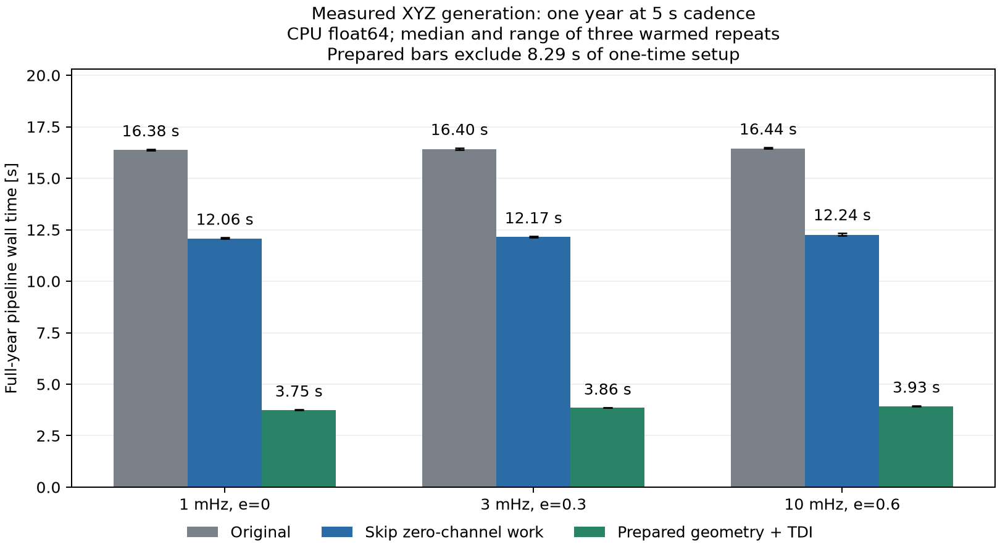

# Complete-pipeline optimization timings

Three source cases, one year (365.25 days), 5 s cadence, 6,311,520 retained samples per channel. CPU float64, fixed 1PN with periastron advance, generation-2 XYZ, interpolation orders 3/3, one source per evaluation. Three warmed repeats per case and method; execution order randomized within blocks.

| Case | Original | Improved ordinary call | Prepared repeat | Ordinary speedup | Prepared speedup |
|---|---:|---:|---:|---:|---:|
| 1 mHz, e=0 | 16.381 s | 12.059 s | 3.746 s | 1.36x | 4.37x |
| 3 mHz, e=0.3 | 16.401 s | 12.169 s | 3.861 s | 1.35x | 4.25x |
| 10 mHz, e=0.6 | 16.443 s | 12.237 s | 3.926 s | 1.34x | 4.19x |

## What was timed

- Original: geometry + JAX waveform/links + the original full-beatnote pyTDI path, reconstructed explicitly in the benchmark. It does not call the newly optimized ordinary bridge.
- Improved: geometry + JAX waveform/links + the GW-only eta shortcut, with TDI operators rebuilt each call.
- Prepared repeat: JAX waveform/links + prepared TDI evaluation, with geometry and operators reused. Both prepared and ordinary paths still generate a new source waveform on every timed evaluation.
- Every total is the sum of measured complete block-call wall intervals across the year. NumPy materialization synchronizes JAX output. Imports, initial JIT warmup, validation, and output writing are excluded.

## Preparation and cache scope

Measured once-per-grid setup totals: geometry **2.528 s**, TDI operators **5.760 s**, combined **8.288 s**. Add this setup cost when no reusable cache exists; the prepared-repeat column excludes it.

The experiment prepares each padded 65,536-sample block once, evaluates all three sources and their repetitions, then releases that block. This measures a real bounded-memory reuse workflow; it does not assume that all 97 blocks' prepared operators fit in memory simultaneously. Repeated whole-year likelihood calls would need retained caches, a storage strategy, or repeated setup. Setup is amortized over nine source evaluations in this experiment.

## Validation and interpretation

Every generated block was checked against the original, including halo and boundary samples. All outputs were finite. Maximum full-year relative L2 difference across XYZ, cases and repeats: **0**.

All three modes retain identical source physics, cadence, delay order, TDI generation, and interpolation order. These are complete-pipeline speedups, distinct from the earlier TDI-only 6.3x result. The underlying 5 s configuration is not claimed to be accuracy-converged: the earlier 10 mHz/e=0.6 test changed by about 11% when cadence was halved. The optimizations preserve that configuration's output.



[Raw timings, configuration, hashes, and versions](timings.json) · [Stage medians and repeat ranges](summary.csv)

Reproduce:

```sh
MPLCONFIGDIR=/private/tmp/egb-benchmark-mpl .venv-benchmark/bin/python benchmarks/compare_pipeline_optimizations.py
.venv-benchmark/bin/python benchmarks/summarize_pipeline_optimizations.py
```
